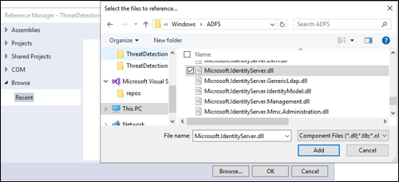
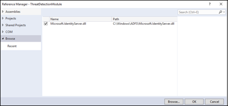
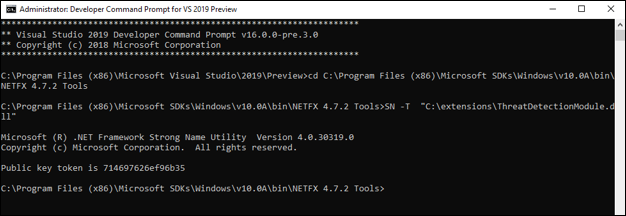

# Build plug-in to block or enforce MFA based on riskiness of the user determined by AzureAD Identity Protection tool

Build your own plug-in with [AD FS Risk Assessment Model](https://docs.microsoft.com/en-us/windows-server/identity/ad-fs/development/ad-fs-risk-assessment-model) that uses the riskiness of a user determined by [Azure AD Identity Protection](https://docs.microsoft.com/en-us/azure/active-directory/identity-protection/overview-identity-protection) tool to
- Allow “no risk” user to authenticate against AD FS
- Block “high risk” user from authenticating
- Enforce additional authentication (MFA) for “low risk” or “medium risk” user

 >[!NOTE]
 >If you have an AD FS farm, the above needs to be executed on each AD FS server in the farm. 

## Prerequisites

- AD FS 2019 installed and configured
- Synchronize AD (on-prem) users with Azure AD using synchronization tools such as [Azure AD Connect](https://docs.microsoft.com/en-us/azure/active-directory/hybrid/whatis-azure-ad-connect)
-  Azure AD Premium P2 license to be able to call [riskyUser API](https://docs.microsoft.com/en-us/graph/api/resources/riskyuser?view=graph-rest-beta)
- Configure additional authentication method for AD FS such as [Azure MFA](https://docs.microsoft.com/en-us/windows-server/identity/ad-fs/operations/configure-ad-fs-and-azure-mfa)
- .NET Framework 4.7 and above
- Visual Studio


## Build plug-in dll

The following procedure will walk you through building a sample plug-in dll.

1. Download the sample plug-in, use Git Bash and type the following: 

   ```
   git clone https://github.com/Microsoft/adfs-sample-RiskAssessmentModel-RiskyIPBlock
   ```

2. Create a **.csv** file at any location on your AD FS server (In my case, I created the **authconfigdb.csv** file at **C:\extensions**) and add the IPs you want to block to this file. 

   The sample plug-in will block any authentication requests coming from the **Extranet IPs** listed in this file. 

   >{!NOTE]
   > If you have an AD FS Farm, you can create the file on any or all the AD FS servers. Any of the files can be used to import the risky IPs into AD FS. We will discuss the import process in detail in the [Register the plug-in dll with AD FS](#register-the-plug-in-dll-with-ad-fs) section below. 

3. Open the project `ThreatDetectionModule.sln` using Visual Studio

4. Remove the `Microsoft.IdentityServer.dll` from the Solutions Explorer as shown below:</br>
   

5. Add reference to the `Microsoft.IdentityServer.dll` of your AD FS as shown below

   a.    Right click on **References** in **Solutions Explorer** and select **Add Reference…**</br> 
   
   
   b.    On the **Reference Manager** window select **Browse**. In the **Select the files to reference…** dialogue, select `Microsoft.IdentityServer.dll` from your AD FS installation folder (in my case **C:\Windows\ADFS**) and click **Add**.
   
   >[!NOTE]
   >In my case I am building the plug-in on the AD FS server itself. If your development environment is on a different server, copy the `Microsoft.IdentityServer.dll` from your AD FS installation folder on AD FS server on to your development box.</br> 
   
   
   
   c.    Click **OK** on the **Reference Manager** window after making sure `Microsoft.IdentityServer.dll` checkbox is selected</br>
   
 
6. All the classes and references are now in place to do a build.   However, since the output of this project is a dll,  it will have to be installed into the **Global Assembly Cache**, or GAC, of the AD FS server and the dll needs to be signed first. This can be done as follows:

   a.    **Right-click** on the name of the project, ThreatDetectionModule. From the menu, click **Properties**.</br>
   
   
   b.    From the **Properties** page, click **Signing**, on the left, and then check the checkbox marked **Sign the assembly**. From the **Choose a strong name key file**: pull down menu, select **<New...>**</br>
   

   c.    In the **Create Strong Name Key dialogue**, type a name (you can choose any name) for the key, uncheck the checkbox **Protect my key file with password**. Then, click **OK**.
   </br>
 
   d.    Save the project as shown below</br>
   

7. Build the project by clicking **Build** and then **Rebuild Solution** as shown below</br>
   
 
   Check the **Output window**, at the bottom of the screen, to see if any errors occurred</br>
   


The plug-in (dll) is now ready for use and is in the **\bin\Debug** folder of the project folder (In my case, that's **C:\extensions\ThreatDetectionModule\bin\Debug\ThreatDetectionModule.dll**). 

The next step is to register this dll with AD FS, so it runs in line with AD FS authentication process. 

### Register the plug-in dll with AD FS

We need to register the dll in AD FS by using the `Register-AdfsThreatDetectionModule` PowerShell command on the AD FS server, however, before we register, we need to get the Public Key Token. This public key token was created when we created the key and signed the dll using that key. To learn what the Public Key Token for the dll is, you can use the **SN.exe** as follows

1. Copy the dll file from the **\bin\Debug** folder to another location (In my case copying it to **C:\extensions**)

2. Start the **Developer Command Prompt** for Visual Studio and go to the directory containing the **sn.exe** (In my case the directory is **C:\Program Files (x86)\Microsoft SDKs\Windows\v10.0A\bin\NETFX 4.7.2 Tools**)
   

3. Run the **SN** command with the **-T** parameter and the location of the file (In my case `SN -T "C:\extensions\ThreatDetectionModule.dll"`)
   </br>
   The command will provide you the public key token (For me, the **Public Key Token is 714697626ef96b35**)

4. Add the dll to the **Global Assembly Cache** of the AD FS server
   Our best practice would be that you create a proper installer for your project and use the installer to add the file to the GAC. Another solution is to use **Gacutil.exe** (more information on **Gacutil.exe** available [here](https://docs.microsoft.com/dotnet/framework/tools/gacutil-exe-gac-tool)) on your development machine.  Since I have my visual studio on the same server as AD FS, I will be using **Gacutil.exe** as follows

   a.    On Developer Command Prompt for Visual Studio and go to the directory containing the **Gacutil.exe** (In my case the directory is **C:\Program Files (x86)\Microsoft SDKs\Windows\v10.0A\bin\NETFX 4.7.2 Tools**)

   b.    Run the **Gacutil** command (In my case `Gacutil /IF C:\extensions\ThreatDetectionModule.dll`)
   
 
   >[!NOTE]
   >If you have an AD FS farm, the above needs to be executed on each AD FS server in the farm. 

5. Open **Windows PowerShell** and run the following command to register the dll
   ```
   Register-AdfsThreatDetectionModule -Name "<Add a name>" -TypeName "<class name that implements interface>, <dll name>, Version=10.0.0.0, Culture=neutral, PublicKeyToken=< Add the Public Key Token from Step 2. above>" -ConfigurationFilePath "<path of the .csv file>"
   ```
   In my case, the command is: 
   ```
   Register-AdfsThreatDetectionModule -Name "IPBlockPlugin" -TypeName "ThreatDetectionModule.UserRiskAnalyzer, ThreatDetectionModule, Version=10.0.0.0, Culture=neutral, PublicKeyToken=714697626ef96b35" -ConfigurationFilePath "C:\extensions\authconfigdb.csv"
   ```
 
   >[!NOTE]
   >You need to register the dll only once, even if you have an AD FS farm. 

6. Restart the AD FS service after registering the dll

That's it, the dll is now registered with AD FS and ready for use!

 >[!NOTE]
 > If any changes are made to the plugin and the project is rebuilt, then the updated dll needs to be registered again. Before registering, you will need to unregister the current dll using the following command:</br></br>
 >`
  UnRegister-AdfsThreatDetectionModule -Name "<name used while registering the dll in 5. above>"
 >`</br></br> 
 >In my case, the command is:
 >``` 
 >UnRegister-AdfsThreatDetectionModule -Name "IPBlockPlugin"
 >```

## Running the sample

Outline step-by-step instructions to execute the sample and see its output. Include steps for executing the sample from the IDE, starting specific services in the Azure portal or anything related to the overall launch of the code.

## Key concepts

Provide users with more context on the tools and services used in the sample. Explain some of the code that is being used and how services interact with each other.

## Contributing

This project welcomes contributions and suggestions.  Most contributions require you to agree to a
Contributor License Agreement (CLA) declaring that you have the right to, and actually do, grant us
the rights to use your contribution. For details, visit https://cla.opensource.microsoft.com.

When you submit a pull request, a CLA bot will automatically determine whether you need to provide
a CLA and decorate the PR appropriately (e.g., status check, comment). Simply follow the instructions
provided by the bot. You will only need to do this once across all repos using our CLA.

This project has adopted the [Microsoft Open Source Code of Conduct](https://opensource.microsoft.com/codeofconduct/).
For more information see the [Code of Conduct FAQ](https://opensource.microsoft.com/codeofconduct/faq/) or
contact [opencode@microsoft.com](mailto:opencode@microsoft.com) with any additional questions or comments.
